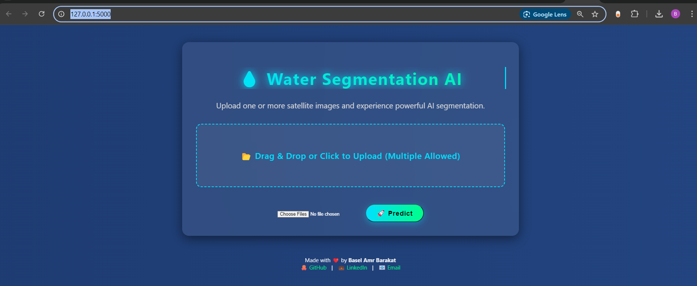

# 🌊 AquaVision – AI-Powered Water Segmentation from Satellite Imagery  

  
  
  
  
  

> **Semantic segmentation of water bodies using multispectral satellite imagery.**  
> Built with **PyTorch**, optimized with **Optuna**, and deployed using **Flask + ONNX Runtime**.  

---

## 📌 Summary
**AquaVision** is an AI solution that segments water bodies from multispectral satellite images.  
- **Tech Stack:** PyTorch, Optuna, Flask, ONNX Runtime, HTML/CSS/JS  
- **Performance:** Train F1 **0.94** (IoU **0.88**) | Validation F1 **0.85** (IoU **0.75**)  
- **Deployment:** Flask web app for real-time image upload and mask prediction.  

---

## 🏆 Model Performance
```
Train Loss: 0.1195 | F1: 0.9408 | IoU: 0.8882 
Val Loss: 0.1352  | F1: 0.8572 | IoU: 0.7500
```
**Best Trial from Optuna:**  
```python
{'model': 'FCN_ResNet50', 'lr': 0.00030253639490531494, 'optimizer': 'Adam'}
```

---

## 🚀 Features
- **Multi-Image Upload:** Upload one or more `.tif` images for batch predictions.  
- **Visualization:** Display original image, ground truth mask, and predicted mask side by side.  
- **Modern UI:** Neon-inspired animated design with progress indicators.  
- **Lightweight Deployment:** Runs locally on CPU using ONNX Runtime.  

---

## 📂 Project Structure
```
Water-Segmentation-Project/
│
├── app.py                # Flask entry point
├── requirements.txt      # Python dependencies
├── model/
│   └── best_model.onnx   # Optimized ONNX model
│
├── static/
│   ├── css/style.css     # Custom styling
│   ├── js/script.js      # Progress bar + animations
│   ├── uploads/          # Uploaded images
│   └── results/          # Prediction results
│
├── templates/
│   ├── index.html        # Upload page
│   └── result.html       # Prediction visualization
│
├── utils/
│   └── inference.py      # Prediction & visualization helpers
│
└── Assets/               # Demo images & video
    ├── demo_video.mp4
    ├── HomePage.png
    └── PredictedResult.png
```

---

## 📸 Screenshots & Demo

### **1. Home Page**


### **2. Prediction Result**


### **3. Demo Video**
[](Assets/demo_video.mp4)

---

## ⚙️ Installation & Usage
### **1. Clone the Repository**
```bash
git clone https://github.com/Basel-Amr/Water-Segmentation-Project.git
cd Water-Segmentation-Project
```

### **2. Install Dependencies**
```bash
pip install -r requirements.txt
```

### **3. Run the App**
```bash
python app.py
```
Open in browser: **http://127.0.0.1:5000/**

---

## 🔮 Future Improvements
- Add **Docker support** for container deployment.  
- Integrate **FastAPI** for high-performance inference.  
- Deploy to **AWS/GCP** for production-scale services.  
- Add **user account system** for managing uploaded data.

---

## 👤 Author
**Basel Amr Barakat**  
- **GitHub:** [Basel-Amr](https://github.com/Basel-Amr/Water-Segmentation-Project)  
- **LinkedIn:** [Basel Amr Barakat](https://www.linkedin.com/in/baselamrbarakat/)  
- **Email:** baselamr52@gmail.com  

---

## ⭐ Star This Repo
If you find this project useful, please give it a ⭐ on [GitHub](https://github.com/Basel-Amr/Water-Segmentation-Project).
